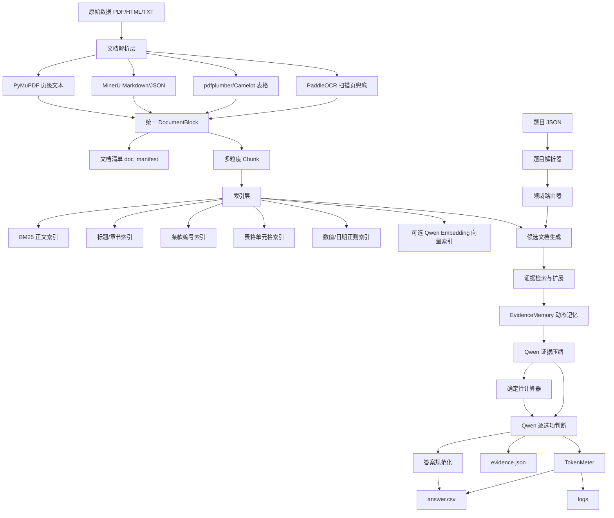
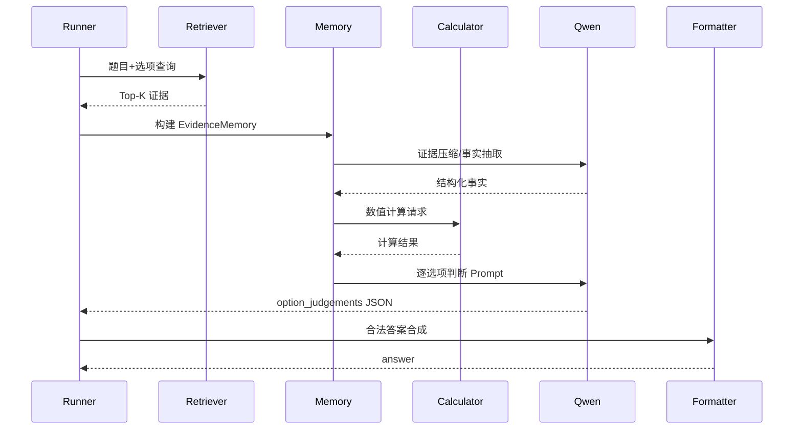

# 金融Agent问答系统技术架构文档

版本：v1.0  
日期：2026-06-13  
目标：依据赛题需求与技术调研，设计一个合规、可复现、证据可追溯、Token 高效的金融长文本 Agent 问答系统。

## 1. 架构原则

第一，证据优先。所有答案必须能追溯到给定文档中的原始证据片段，不能用模型常识替代文档证据。

第二，检索优先于长上下文。Qwen3.6-plus 虽支持 1M 上下文，但直接全文输入会带来高 Token 成本和噪声，应作为兜底而不是默认策略。

第三，选项级判断。把 A/B/C/D 选项拆成独立声明，分别检索证据和判断真假，最终答案由程序合成。

第四，动态记忆压缩。上下文中只保留当前题目必要证据。压缩不替代原文，而是将原文证据转化为结构化事实，便于模型聚焦。

第五，合规隔离。预处理阶段可使用非 Qwen 文档解析工具；正式推理阶段的检索重排、记忆压缩、证据判断和答案生成只使用规则或 Qwen 系列模型。

第六，确定性后处理。数值计算、单位换算、答案字母排序、CSV 生成、Token 汇总全部由程序完成。

## 2. 总体架构



## 3. 分层设计

### 3.1 数据层

数据层保存原始文件、解析结果、索引文件和输出文件。

```text
project/
├── data/
│   ├── raw/
│   ├── questions/
│   └── answers/
├── processed_data/
│   ├── doc_manifest.json
│   ├── documents.jsonl
│   ├── chunks.jsonl
│   ├── tables.jsonl
│   ├── figures.jsonl
│   └── parse_quality.json
├── indexes/
│   ├── bm25/
│   ├── section_index.sqlite
│   ├── regex_index.sqlite
│   ├── table_index.sqlite
│   └── vector_qwen_optional.faiss
├── agent/
├── script/
├── logs/
├── evidence.json
└── answer.csv
```

### 3.2 文档解析层

文档解析层输出统一 `DocumentBlock`。字段设计如下。

```json
{
  "block_id": "annual_byd_2025_report:p0123:b004",
  "doc_id": "annual_byd_2025_report",
  "domain": "financial_reports",
  "source_path": "raw/financial_reports/annual_byd_2025_report.PDF",
  "page_start": 123,
  "page_end": 123,
  "section_path": ["第三节 管理层讨论与分析", "主要会计数据和财务指标"],
  "block_type": "paragraph|table|title|list|formula|figure_caption",
  "text": "...",
  "table_html": null,
  "bbox": [x0, y0, x1, y1],
  "parser": "pymupdf|mineru|pdfplumber|camelot|paddleocr",
  "hash": "sha1"
}
```

解析流程：

1. 读取 PDF 元信息，生成文件哈希和页数。
2. PyMuPDF 抽取页级文本与基本块。
3. 若页文本字符数低于阈值或乱码率高，触发 OCR。
4. MinerU 生成 Markdown/JSON，用于阅读顺序、标题层级、表格 HTML。
5. pdfplumber/Camelot 对表格页做二次抽取。
6. 合并解析器输出，按页码与坐标去重。
7. 生成 `parse_quality.json`，记录低质量页、空白页、表格页和 OCR 页。

### 3.3 切分层

切分策略按领域自适应。

| 领域 | 主要切分方式 | 说明 |
|---|---|---|
| insurance | 条款块 + 公式块 | 保持保险责任、身故金、退保、领取规则完整 |
| regulatory | 章/条/款/项层级块 | 条文编号是强检索信号 |
| financial_contracts | 章节块 + 表格块 + 页窗口 | 发行摘要、评级、受托管理、违约条款独立切分 |
| financial_reports | 表格行组 + 指标块 + 年份块 | 保留表格名称、单位、年份、指标别名 |
| research | 图表块 + 周边段落 | 保留图表标题、注释、数据来源 |

Chunk 字段：

```json
{
  "chunk_id": "text04:sec_发行概况:p10_12:c001",
  "doc_id": "text04",
  "parent_id": "text04:sec_发行概况",
  "domain": "financial_contracts",
  "text": "...",
  "tokens_est": 820,
  "keywords": ["发行人", "发行规模", "主体评级"],
  "numbers": ["50亿元", "AAA"],
  "page_range": [10, 12],
  "section_path": ["第一节 发行概况"],
  "block_ids": ["..."]
}
```

## 4. 索引与检索架构

### 4.1 索引类型

| 索引 | 作用 | 正式合规性 |
|---|---|---|
| BM25 正文索引 | 通用关键词召回 | 合规，规则/统计方法 |
| 标题/章节索引 | 文档定位和章节定位 | 合规 |
| 条款编号索引 | 监管、合同、保险条款 | 合规 |
| 数值/日期索引 | 金额、比例、年份、期限 | 合规 |
| 表格索引 | 财报、合同、研报表格 | 合规 |
| Qwen Embedding 向量索引 | 语义召回 | 需赛题方确认；默认关闭 |
| 非 Qwen 向量索引 | 调试 | 正式禁用 |

### 4.2 查询生成

对每道题生成多路查询。

```json
{
  "qid": "fin_a_001",
  "base_query": "比亚迪 2025 2024 营业收入 归母净利润 经营活动现金流 研发投入占比",
  "option_queries": {
    "A": "2025 年营业收入 较 2024 年 增长",
    "B": "2025 归属于上市公司股东的净利润 下滑",
    "C": "经营活动产生的现金流量净额 2025 2024",
    "D": "研发投入占营业收入比例 2025 2024 下降"
  },
  "numeric_queries": ["2025", "2024"],
  "entity_queries": ["比亚迪"]
}
```

### 4.3 检索融合

每一路查询返回 Top-N chunk，使用 RRF 融合。融合后执行领域过滤、文档过滤、去重和证据扩展。

```python
def rrf_fuse(rank_lists, k=60):
    score = defaultdict(float)
    for results in rank_lists:
        for rank, item in enumerate(results, start=1):
            score[item.chunk_id] += 1.0 / (k + rank)
    return sorted(score.items(), key=lambda x: x[1], reverse=True)
```

A 榜优先使用题目给定 `doc_ids` 限定检索范围；B 榜先在领域内做候选文档召回，再进入文档内 chunk 检索。

## 5. 动态记忆压缩设计

### 5.1 EvidenceMemory 数据结构

```json
{
  "qid": "reg_a_014",
  "memory_budget_tokens": 6000,
  "evidence_items": [
    {
      "evidence_id": "e1",
      "doc_id": "strict_csrc_035",
      "chunk_id": "strict_csrc_035:p12:article47",
      "page": 12,
      "section": "第四十七条",
      "quote": "公司下列对外担保行为，须经股东会审议通过...",
      "facts": [
        {
          "subject": "对外担保",
          "condition": "担保对象资产负债率超过70%",
          "obligation": "须经股东会审议通过",
          "supports": ["A"]
        }
      ],
      "score": 0.92
    }
  ],
  "conflicts": [],
  "missing_slots": ["事项②特别决议依据"]
}
```

### 5.2 压缩算法

```text
输入：题目、选项、Top-K chunk、预算 B
输出：EvidenceMemory

1. 对每个选项检索候选证据。
2. 按 doc_id、section、page 去重，保留证据多样性。
3. 对命中表格执行同表扩展，对命中条款执行条款上下文扩展。
4. 若总 Token <= B，直接进入判断。
5. 若总 Token > B：
   5.1 使用规则删除页眉页脚、目录噪声、重复免责声明。
   5.2 使用 Qwen 将证据抽取为结构化事实，必须保留 evidence_id 和原文短引。
   5.3 对每个选项至少保留一条支持或反驳证据；缺失则触发二次检索。
6. 输出 EvidenceMemory。
```

### 5.3 记忆分层

| 层级 | 内容 | 生命周期 | Token 策略 |
|---|---|---|---|
| Raw Evidence | 原文短引、页码、表格行 | 单题 | 必须保留关键片段 |
| Structured Facts | 主体、指标、数值、条件、结论 | 单题 | 压缩后进入最终 Prompt |
| Working State | 已判断选项、缺失证据、冲突 | 单题多轮 | 小 JSON |
| Global Cache | 高频文档标题、章节目录、别名词典 | 全局 | 不含非 Qwen 语义摘要 |

## 6. 推理与答案生成

### 6.1 逐选项判断流程



### 6.2 选项判断规则

- `true`：选项被证据直接支持，且无关键条件冲突。
- `false`：选项被证据反驳，或关键数值/条件/主体错误。
- `unknown`：证据不足。最终合成时一般按 `false` 处理，但会触发二次检索或自检。

### 6.3 自检触发条件

以下情况触发 Self Check：

1. `multi` 题所有选项均为 false 或所有选项均为 true。
2. `mcq` 题 true 选项数量不等于 1。
3. `tf` 题 A/B 含义无法解析。
4. 任一选项 `confidence < 0.55`。
5. 检索证据来自单一 chunk 且题目要求跨文档比较。
6. 计算结果与模型理由不一致。
7. 答案与启发式强规则冲突，例如“题干要求正确的有”但输出为空。

自检只对低置信题触发，避免 Token 失控。

## 7. 领域适配器设计

### 7.1 InsuranceAdapter

能力：产品名识别、保险责任识别、身故保险金公式抽取、退保金额规则、领取日前后条件、年龄系数解析。

关键函数：

```python
normalize_insurance_product(name) -> product_id
extract_benefit_formula(chunks, benefit_type) -> Formula
compute_death_benefit(formula, variables) -> Money
compare_products(values) -> ranking
```

### 7.2 RegulatoryAdapter

能力：法规标题识别、条文编号解析、施行日期解析、义务主体和时限抽取、授权性/禁止性/强制性用语识别。

关键函数：

```python
parse_article_no(text) -> ArticleRef
extract_deadline(text) -> Deadline
classify_modality(text) -> must|may|prohibit
match_legal_condition(option, clause) -> verdict
```

### 7.3 ContractAdapter

能力：债券发行要素抽取、发行主体、发行规模、评级、受托管理人、募集资金用途、担保、违约责任和持有人会议条款识别。

关键函数：

```python
extract_bond_profile(doc_id) -> BondProfile
retrieve_contract_clause(doc_id, clause_type) -> Evidence
compare_bond_profiles(profile_a, profile_b) -> Facts
```

### 7.4 FinancialReportAdapter

能力：公司年份识别、财务指标别名、单位换算、同比比较、分红比例、现金流、研发投入占比。

关键函数：

```python
normalize_metric_name(text) -> metric_id
normalize_unit(value, unit) -> Decimal
extract_financial_metric(company, year, metric) -> MetricValue
compare_metric(v1, v2, direction) -> bool
```

### 7.5 ResearchAdapter

能力：研报标题识别、图表标题和注释抽取、市场规模/增速/预测值解析、行业与公司对比。

关键函数：

```python
extract_chart_context(page) -> ChartBlock
retrieve_market_forecast(entity, year, metric) -> Evidence
verify_research_claim(option, evidence) -> verdict
```

## 8. 模型调用策略

### 8.1 默认策略

| 场景 | 模型 | thinking | temperature | 输出 |
|---|---|---:|---:|---|
| 普通证据抽取 | qwen3.6-plus | false | 0 | JSON |
| 普通逐选项判断 | qwen3.6-plus | false | 0 | JSON |
| 复杂法规/计算自检 | qwen3.6-plus | true | 0 | JSON 或 JSON 修复 |
| 大量题目离线跑批 | qwen3.6-plus batch | false | 0 | JSON |

### 8.2 Token 预算建议

A 榜 100 题建议预算：

| 模块 | 平均输入 Token/题 | 触发率 | A榜估算 |
|---|---:|---:|---:|
| 题目解析 | 0-600 | 30% | 18,000 |
| 证据压缩 | 3,000-5,000 | 100% | 300,000-500,000 |
| 逐选项判断 | 4,000-8,000 | 100% | 400,000-800,000 |
| 自检 | 4,000-8,000 | 30% | 120,000-240,000 |
| 输出 Token | 100-300 | 100% | 10,000-30,000 |
| 合计 | — | — | 约 0.85M-1.59M |

全量 200 题可按 2 倍估计约 1.7M-3.2M，低于 5M TokenBudget。实际取决于 B 榜候选文档定位和二次检索次数。

### 8.3 错误恢复

| 异常 | 处理 |
|---|---|
| API 超时 | 指数退避重试，最多 3 次 |
| JSON 解析失败 | 调用 JSON repair prompt 一次；失败则规则提取字母并标记低置信 |
| 无证据 | 扩展查询词，增大 Top-K，跨页扩展 |
| 多选为空 | 自检触发；若仍为空，选择最高置信 true 或按证据反驳保持空但记录异常 |
| 单选多个 true | 自检；若仍多个，取最高置信且证据最多的选项 |
| Token 超预算 | 降低 Top-K，减少自检，启用更强规则裁剪 |

## 9. 输出文件规范

### 9.1 answer.csv

```csv
qid,answer,prompt_tokens,completion_tokens,total_tokens
summary,,1234567,23456,1258023
fin_a_001,AC,7500,120,7620
```

### 9.2 evidence.json

```json
{
  "qid": "fin_a_001",
  "domain": "financial_reports",
  "answer": "AC",
  "doc_candidates": [
    {"doc_id": "annual_byd_2024_report", "score": 1.0},
    {"doc_id": "annual_byd_2025_report", "score": 1.0}
  ],
  "evidence_retrieval": [
    {
      "evidence_id": "e1",
      "doc_id": "annual_byd_2025_report",
      "page": 12,
      "chunk_id": "...",
      "quote": "...",
      "retrieval_scores": {"bm25": 12.3, "rrf": 0.031}
    }
  ],
  "option_judgements": [
    {
      "option": "A",
      "verdict": "true",
      "confidence": 0.91,
      "evidence_ids": ["e1", "e2"],
      "short_reason": "2025营业收入高于2024。"
    }
  ],
  "model_calls": [
    {
      "call_type": "option_judge",
      "model": "qwen3.6-plus",
      "prompt_tokens": 7200,
      "completion_tokens": 120,
      "total_tokens": 7320
    }
  ]
}
```

## 10. 运行入口

建议命令：

```bash
# 1. 预处理
python script/preprocess.py   --raw_dir data/raw   --out_dir processed_data   --config configs/preprocess.yaml

# 2. 构建索引
python script/build_index.py   --processed_dir processed_data   --index_dir indexes   --config configs/strict_competition.yaml

# 3. 作答
python script/run_agent.py   --questions data/questions/group_a   --index_dir indexes   --out_answer answer.csv   --out_evidence evidence.json   --config configs/strict_competition.yaml

# 4. 校验
python script/validate_submission.py --answer answer.csv --evidence evidence.json
```

## 11. 目录与模块划分

```text
agent/
├── __init__.py
├── config.py
├── schemas.py
├── parser/
│   ├── pdf_parser.py
│   ├── html_parser.py
│   ├── table_parser.py
│   └── quality_checker.py
├── indexing/
│   ├── chunker.py
│   ├── bm25_index.py
│   ├── regex_index.py
│   ├── table_index.py
│   └── qwen_vector_index_optional.py
├── retrieval/
│   ├── query_builder.py
│   ├── retriever.py
│   ├── rrf.py
│   └── evidence_expander.py
├── memory/
│   ├── evidence_memory.py
│   └── compressor.py
├── reasoning/
│   ├── qwen_client.py
│   ├── prompts.py
│   ├── option_judge.py
│   ├── self_check.py
│   └── calculators.py
├── adapters/
│   ├── insurance.py
│   ├── regulatory.py
│   ├── financial_contracts.py
│   ├── financial_reports.py
│   └── research.py
├── output/
│   ├── answer_formatter.py
│   ├── token_meter.py
│   └── evidence_writer.py
└── runner.py
```

## 12. 配置文件示例

```yaml
run:
  split: A
  max_workers: 4
  resume: true
  random_seed: 42

compliance:
  profile: strict_competition
  allow_non_qwen_inference: false
  allow_non_qwen_embedding: false
  allow_precomputed_semantic_summary: false

models:
  judge_model: qwen3.6-plus
  compressor_model: qwen3.6-plus
  self_check_model: qwen3.6-plus
  temperature: 0
  default_enable_thinking: false

retrieval:
  top_docs_b: 8
  top_chunks_per_query: 20
  final_evidence_per_option: 5
  use_rrf: true
  use_qwen_embedding: false
  chunk_size_chars: 800
  chunk_overlap_chars: 120

memory:
  max_prompt_tokens_normal: 8000
  max_prompt_tokens_hard: 16000
  keep_raw_quote_chars: 420
  trigger_self_check_confidence: 0.55

output:
  answer_csv: answer.csv
  evidence_json: evidence.json
  logs_dir: logs
```

## 13. B榜扩展策略

B榜缺失 `doc_ids`，因此需要增加候选文档定位步骤。

```text
题目 -> 领域过滤 -> 文档标题/正文 BM25 -> 实体/数值/法规名召回 -> RRF 融合 -> Top-M 文档 -> 文档内证据检索
```

候选文档定位特征：

- 文档标题和文件名。
- 题干中的公司名、产品名、法规名、债券简称、行业名。
- 年份、金额、比例和特定术语。
- 选项中重复出现的实体。
- 领域特定章节名，如“发行概况”“主要会计数据”“保险责任”“第四十七条”。

B榜内部模拟：在 A 榜隐藏 `doc_ids`，评估 DocRecall@1/3/5/10。只有候选文档命中率稳定后，再进行正式 B 榜作答。

## 14. 准确率提升路线

1. 先做高质量解析，特别是财报和合同表格。
2. 在 A 榜上标注每题证据，评估 EvidenceRecall@K。
3. 建立领域别名词典和指标词典。
4. 逐选项判断替代整题一次性问答。
5. 将计算交给 Python，模型只选择公式和证据。
6. 对错题回溯：解析错、召回错、压缩丢失、模型误判、后处理错分别归因。
7. 只对高价值场景启用自检，避免 Token 浪费。

## 15. 结论

推荐架构是“结构化解析 + 合规多路检索 + EvidenceMemory 动态压缩 + Qwen 逐选项判断 + 程序化答案生成”。该架构能针对 A 榜给定文档快速形成准确闭环，也能扩展到 B 榜的盲文档定位。在成本控制上，系统避免全文输入，把 Token 主要用于证据压缩和最终判断；在合规上，正式模式禁用非 Qwen 推理和语义检索；在可审计上，所有答案均写入 `evidence.json` 并保留原文来源。
